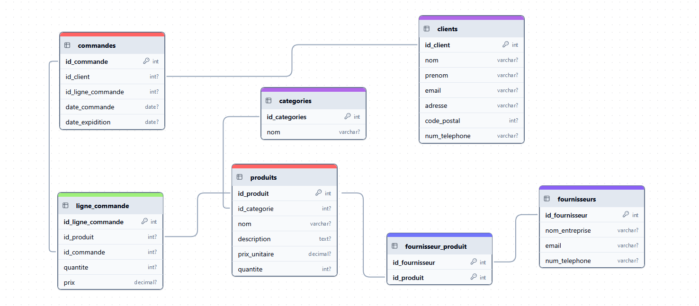

# vdeu

Version finale du projet server db

## Tables des matieres

- [Lancement du POC](#lancement-du-projet-)
- [Listes des endpoints](#liste-des-endpoints-)
- [Diagramme MLD](#diagramme-mld-base-de-donnees)
- [Amelioration](#amelioration)

--- 

### Installation et lancement du projet

#### Recuperation du projet
````shell
git clone https://github.com/ghmars7/vdeu.git 
````
````shell
cd vun 
````

#### Creation de l'utilisateur 

````mysql
-- Créer l'utilisateur
CREATE USER app_user IDENTIFIED BY 'password';

-- Accorder les privilèges CRUD
GRANT SELECT, INSERT, UPDATE, ALTER, DELETE ON usinepapier.* TO app_user;

-- Rafraîchir les privilèges
FLUSH PRIVILEGES;
````

#### Lancement

````shell
npm install 
````
````shell
node server.js 
````

---

### Liste des endpoints

#### **Clients**

#### **POST /clients**
- **Description** : Crée un nouveau client.
- **Paramètres** (JSON dans le corps de la requête) :
  ```json
  {
    "nom": "Dupont",
    "prenom": "Jean",
    "email": "jean.dupont@example.com",
    "adresse": "123 Rue de Paris",
    "code_postal": 75000,
    "num_telephone": "0612345678"
  }
  ```
- **Retour** :
  ```json
  {
    "id_client": 1,
    "nom": "Dupont",
    "prenom": "Jean",
    "email": "jean.dupont@example.com",
    "adresse": "123 Rue de Paris",
    "code_postal": 75000,
    "num_telephone": "0612345678"
  }
  ```

#### **GET /clients**
- **Description** : Récupère tous les clients.
- **Retour** :
  ```json
  [
    {
      "id_client": 1,
      "nom": "Dupont",
      "prenom": "Jean",
      "email": "jean.dupont@example.com",
      "adresse": "123 Rue de Paris",
      "code_postal": 75000,
      "num_telephone": "0612345678"
    }
  ]
  ```

#### **GET /clients/:id**
- **Description** : Récupère un client par son ID.
- **Exemple** : `GET /clients/1`
- **Retour** :
  ```json
  {
    "id_client": 1,
    "nom": "Dupont",
    "prenom": "Jean",
    "email": "jean.dupont@example.com",
    "adresse": "123 Rue de Paris",
    "code_postal": 75000,
    "num_telephone": "0612345678"
  }
  ```

#### **PUT /clients/:id**
- **Description** : Met à jour un client existant.
- **Exemple** : `PUT /clients/1`
- **Paramètres** (JSON dans le corps de la requête) :
  ```json
  {
    "adresse": "456 Rue de Lyon"
  }
  ```
- **Retour** :
  ```json
  {
    "message": "Client mis à jour avec succès"
  }
  ```

#### **DELETE /clients/:id**
- **Description** : Supprime un client par son ID.
- **Exemple** : `DELETE /clients/1`
- **Retour** :
  ```json
  {
    "message": "Client supprimé avec succès"
  }
  ```

---

#### **Fournisseurs**

#### **POST /fournisseurs**
- **Description** : Crée un nouveau fournisseur.
- **Paramètres** (JSON dans le corps de la requête) :
  ```json
  {
    "nom_entreprise": "Fournisseur A",
    "email": "a@example.com",
    "num_telephone": "0123456789"
  }
  ```
- **Retour** :
  ```json
  {
    "id_fournisseur": 1,
    "nom_entreprise": "Fournisseur A",
    "email": "a@example.com",
    "num_telephone": "0123456789"
  }
  ```

#### **GET /fournisseurs**
- **Description** : Récupère tous les fournisseurs.
- **Retour** :
  ```json
  [
    {
      "id_fournisseur": 1,
      "nom_entreprise": "Fournisseur A",
      "email": "a@example.com",
      "num_telephone": "0123456789"
    }
  ]
  ```

#### **GET /fournisseurs/:id**
- **Description** : Récupère un fournisseur par son ID.
- **Exemple** : `GET /fournisseurs/1`
- **Retour** :
  ```json
  {
    "id_fournisseur": 1,
    "nom_entreprise": "Fournisseur A",
    "email": "a@example.com",
    "num_telephone": "0123456789"
  }
  ```

#### **PUT /fournisseurs/:id**
- **Description** : Met à jour un fournisseur existant.
- **Exemple** : `PUT /fournisseurs/1`
- **Paramètres** (JSON dans le corps de la requête) :
  ```json
  {
    "email": "new.email@example.com"
  }
  ```
- **Retour** :
  ```json
  {
    "message": "Fournisseur mis à jour avec succès"
  }
  ```

#### **DELETE /fournisseurs/:id**
- **Description** : Supprime un fournisseur par son ID.
- **Exemple** : `DELETE /fournisseurs/1`
- **Retour** :
  ```json
  {
    "message": "Fournisseur supprimé avec succès"
  }
  ```

---

#### **Catégories**

#### **POST /categories**
- **Description** : Crée une nouvelle catégorie.
- **Paramètres** (JSON dans le corps de la requête) :
  ```json
  {
    "nom": "Cat"
  }
  ```
- **Retour** :
  ```json
  {
    "id_categories": 1,
    "nom": "Cat"
  }
  ```

#### **GET /categories**
- **Description** : Récupère toutes les catégories.
- **Retour** :
  ```json
  [
    {
      "id_categories": 1,
      "nom": "Cat"
    }
  ]
  ```

#### **GET /categories/:id**
- **Description** : Récupère une catégorie par son ID.
- **Exemple** : `GET /categories/1`
- **Retour** :
  ```json
  {
    "id_categories": 1,
    "nom": "Cat"
  }
  ```

#### **PUT /categories/:id**
- **Description** : Met à jour une catégorie existante.
- **Exemple** : `PUT /categories/1`
- **Paramètres** (JSON dans le corps de la requête) :
  ```json
  {
    "nom": "Cat 42"
  }
  ```
- **Retour** :
  ```json
  {
    "message": "Catégorie mise à jour avec succès"
  }
  ```

#### **DELETE /categories/:id**
- **Description** : Supprime une catégorie par son ID.
- **Exemple** : `DELETE /categories/1`
- **Retour** :
  ```json
  {
    "message": "Catégorie supprimée avec succès"
  }
  ```

---

#### **Produits**

#### **POST /produits**
- **Description** : Crée un nouveau produit.
- **Paramètres** (JSON dans le corps de la requête) :
  ```json
  {
    "id_categorie": 1,
    "nom": "Cat 1",
    "description": "Papier blanc",
    "prix_unitaire": 5.99,
    "quantite": 1000
  }
  ```
- **Retour** :
  ```json
  {
    "id_produit": 1,
    "id_categorie": 1,
    "nom": "Cat 1",
    "description": "Papier blanc",
    "prix_unitaire": 5.99,
    "quantite": 1000
  }
  ```

#### **GET /produits**
- **Description** : Récupère tous les produits avec leurs relations.
- **Retour** :
  ```json
  [
    {
      "id_produit": 1,
      "id_categorie": 1,
      "nom": "Papier A4",
      "description": "Papier blanc",
      "prix_unitaire": 5.99,
      "quantite": 1000,
      "Categorie": {
        "id_categories": 1,
        "nom": "Cat 1"
      },
      "Fournisseurs": [
        {
          "id_fournisseur": 1,
          "nom_entreprise": "Fournisseur A"
        }
      ]
    }
  ]
  ```

#### **GET /produits/:id**
- **Description** : Récupère un produit par son ID.
- **Exemple** : `GET /produits/1`
- **Retour** :
  ```json
  {
    "id_produit": 1,
    "id_categorie": 1,
    "nom": "Papier A4",
    "description": "Papier blanc",
    "prix_unitaire": 5.99,
    "quantite": 1000,
    "Categorie": {
      "id_categories": 1,
      "nom": "Cat 1"
    },
    "Fournisseurs": [
      {
        "id_fournisseur": 1,
        "nom_entreprise": "Fournisseur A"
      }
    ]
  }
  ```

#### **PUT /produits/:id**
- **Description** : Met à jour un produit existant.
- **Exemple** : `PUT /produits/1`
- **Paramètres** (JSON dans le corps de la requête) :
  ```json
  {
    "prix_unitaire": 6.99
  }
  ```
- **Retour** :
  ```json
  {
    "message": "Produit mis à jour avec succès"
  }
  ```

#### **DELETE /produits/:id**
- **Description** : Supprime un produit par son ID.
- **Exemple** : `DELETE /produits/1`
- **Retour** :
  ```json
  {
    "message": "Produit supprimé avec succès"
  }
  ```

---

#### **Commandes**

#### **POST /commandes**
- **Description** : Crée une nouvelle commande avec ses lignes de commande.
- **Paramètres** (JSON dans le corps de la requête) :
  ```json
  {
    "id_client": 1,
    "lignes_commande": [
      {
        "id_produit": 1,
        "quantite": 10,
        "prix": 59.9
      }
    ]
  }
  ```
- **Retour** :
  ```json
  {
    "commande": {
      "id_commande": 1,
      "id_client": 1
    },
    "lignes": [
      {
        "id_ligne_commande": 1,
        "id_produit": 1,
        "quantite": 10,
        "prix": 59.9
      }
    ]
  }
  ```

#### **GET /commandes**
- **Description** : Récupère toutes les commandes filtrées par période.
- **Exemple** : `GET /commandes?start=2023-01-01&end=2023-12-31`
- **Retour** :
  ```json
  [
    {
      "id_commande": 1,
      "id_client": 1,
      "date_commande": "2023-05-01",
      "LigneCommandes": [
        {
          "id_ligne_commande": 1,
          "id_produit": 1,
          "quantite": 10,
          "prix": 59.9
        }
      ]
    }
  ]
  ```

#### **GET /clients/:id/commandes**
- **Description** : Récupère toutes les commandes d'un client.
- **Exemple** : `GET /clients/1/commandes`
- **Retour** :
  ```json
  [
    {
      "id_commande": 1,
      "id_client": 1,
      "date_commande": "2023-05-01",
      "LigneCommandes": [
        {
          "id_ligne_commande": 1,
          "id_produit": 1,
          "quantite": 10,
          "prix": 59.9
        }
      ]
    }
  ]
  ```

#### **GET /produits/:id/commandes**
- **Description** : Récupère toutes les commandes contenant un produit spécifique.
- **Exemple** : `GET /produits/1/commandes`
- **Retour** :
  ```json
  [
    {
      "id_commande": 1,
      "id_client": 1,
      "date_commande": "2023-05-01",
      "LigneCommandes": [
        {
          "id_ligne_commande": 1,
          "id_produit": 1,
          "quantite": 10,
          "prix": 59.9
        }
      ]
    }
  ]
  ```

#### **GET /stats/ventes**
- **Description** : Récupère les statistiques de ventes.
- **Exemple** : `GET /stats/ventes?start=2023-01-01&end=2023-12-31`
- **Retour** :
  ```json
  {
    "totalVentes": 599.9,
    "produitsVendus": [
      {
        "id_produit": 1,
        "total_quantite": 100
      }
    ]
  }
  ```

#### **GET /produits/stock-faible**
- **Description** : Récupère les produits avec un stock faible.
- **Exemple** : `GET /produits/stock-faible?seuil=10`
- **Retour** :
  ```json
  [
    {
      "id_produit": 1,
      "nom": "Cat 1",
      "quantite": 5
    }
  ]
  ``` 

---
 
### Diagramme MLD BDD



---

### Amelioration

- utilisation des variables d'environnement
- utilisation d'un compte app_user, avec droit d'acces limiter a la base de donnees
- utilisation d'un ORM - Sequelize
- utilisations de try catch